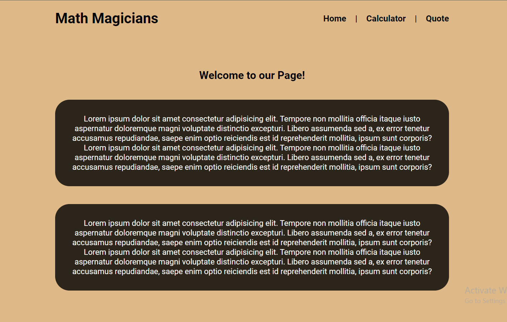
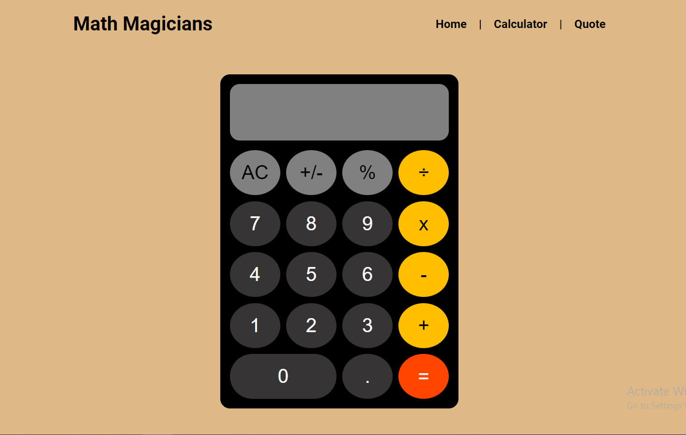
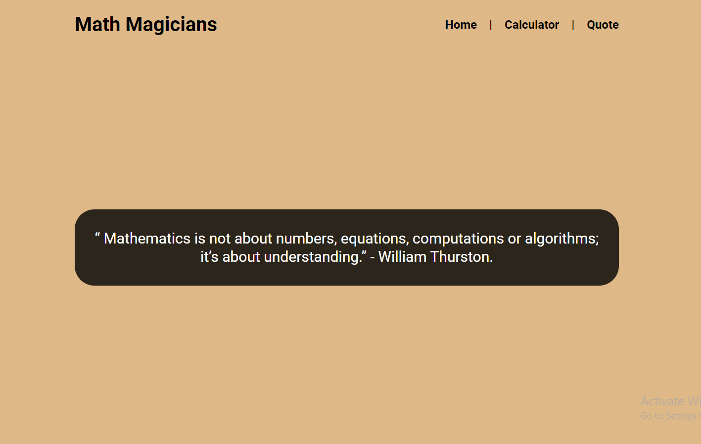

# Math Magicians
## Description
"Math Magicians" is a website built with React for all fans of mathematics. It is a Single Page App (SPA) that allows users to:
- Make simple calculations.
- Read a random math-related quote.

## Live Demo

Live Demo Link @ [Netlify](https://math-magician-o.netlify.app/) or [Heroku](https://math-magician-o.herokuapp.com/)

## Site Screenshots

## Built With

- React.
- HTML.
- CSS.
- Webpack.
- JavaScript.
- Linters.

## Install

- Install node.js from [HERE](https://nodejs.org/en/).

## Test

- `Npm run test`
  
## Deployment

1. Clone the project using git-bash or Githup Desktop.
2. Open the project folder with VSCode or any Editor.
3. Open terminal and navigate to the project folder.
4. Type `npm install`.
5. Type `npm start`.

## Authors

👨‍💻 **Omar Muhammad**

- GitHub: [@Omar-Muhamad](https://github.com/Omar-Muhamad)
- Twitter: [@Eng_OmarMuhamad](https://twitter.com/Eng_OmarMuhamad)
- LinkedIn: [@eng-omarmuhammad](https://www.linkedin.com/in/eng-omarmuhammad/)

## Show your support

Give a ⭐️ if you like this project!
## 📝 License

This project is [MIT](./MIT.md) licensed.
